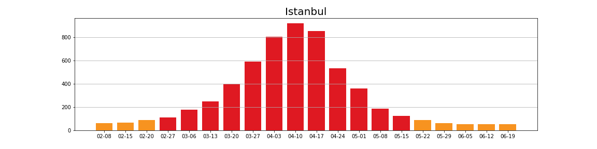
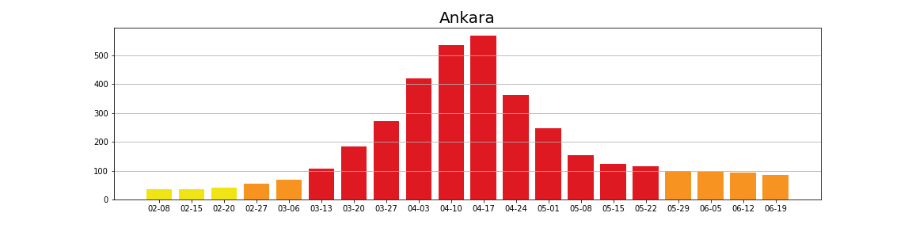
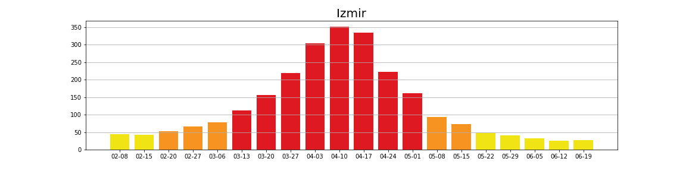
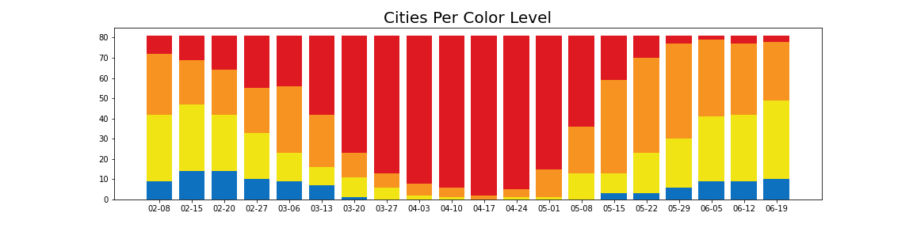
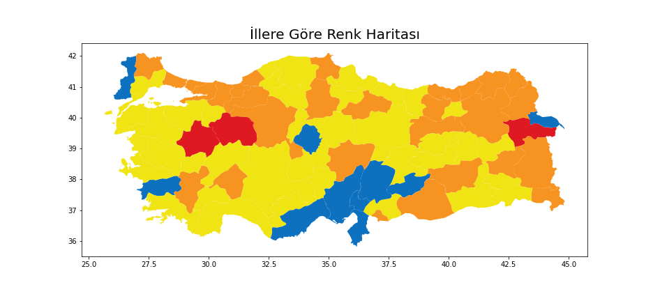
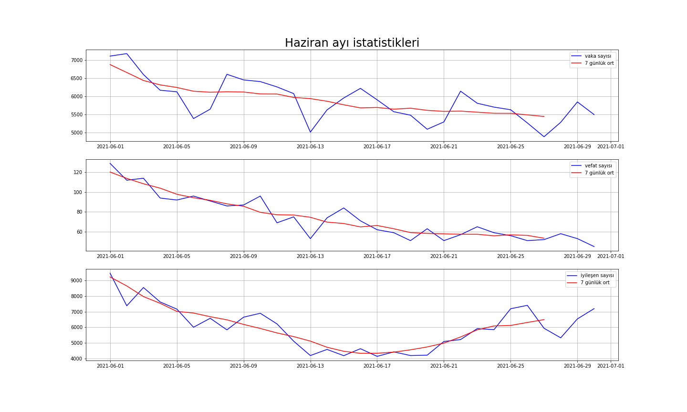

# COVID-19-stats
Coronavirus stats over the world and Turkey with python

## File Structure

* Turkey
  * Dataset
    * genel_koronavirüs_tablosu.csv
    * hospital_discharge.csv
    * hospitalization.csv
    * patient.csv
    * turkey_regional_map.geojson
  * Scraping
    * bölgesel_koronavirüs_tablosu.ipynb
    * genel_koronavirüs_tablosu.ipynb
  * city_stats.ipynb
  * general_stats.ipynb
  * regional_stats.ipynb
* World
  * LSTM_prediction.ipynb
  * world_map.ipynb
 
## Turkey
### City Stats (number of cases per hundred thousand people)

The number of cases tends to decrease after the peak in our 3 big cities. Although we have entered the plateau period, the decrease continues slowly.

If we group the cities according to their color values, we can observe the same pattern.

We can also look at the number of cases on the map. It can help us establish a correlation between factors such as geography, culture, climate and the number of cases.

### June Stats

While the number of cases and deaths showed a decreasing trend in June, the recovery numbers decreased in the middle of the month and then started to rise.

